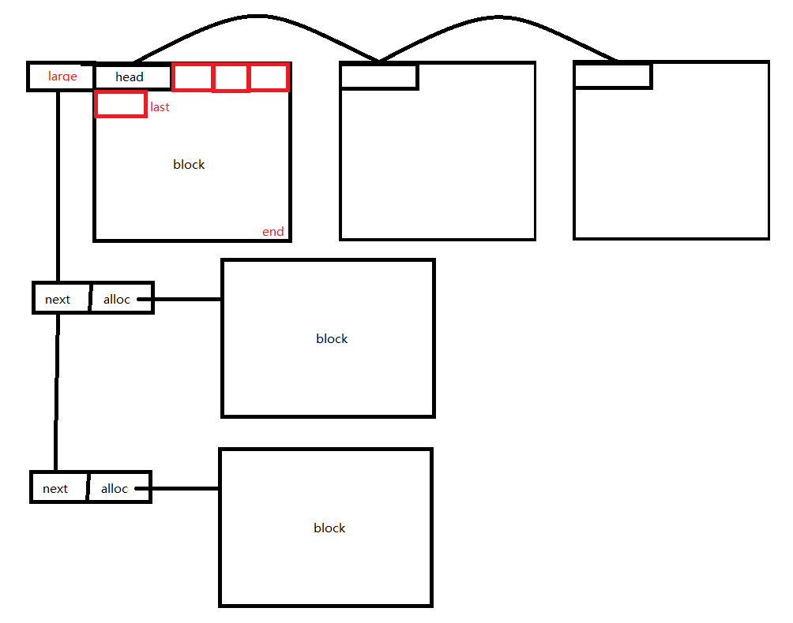

### 内存池

对堆的内存空间进行管理

### 为什么需要用到内存池？

业务长时间运行, 不断 malloc 的情况下, 避免不了因为内存中小碎片太多无法开辟较大内存的情况, 一旦无法开辟新的内存, 进程将无法继续执行, 从而被操作系统 kill 掉, 这对线上程序来说是非常致命的。

### 内存池结构

内存池采用大块和小块进行区分, 大块和小块的界限可以通过指定 size 确定

大致结构如下: 

### 内存池原理

在真正使用内存之前, 预先申请分配一定数量、大小预设的内存块留作备用。当有新的内存需求时, 就从内存池中分出一部分内存块, 若内存块不够再继续申请新的内存, 当内存释放后就回归到内存块留作后续的复用, 使得内存使用效率得到提升, 一般也不会产生不可控制的内存碎片。

### 内存池设计

考虑到长时间运行程序, 小块内存导致的碎片使得程序无法在长时间运行, 也就是说明明有很多内存, 但是这些内存散落在各个地方, 使得无法继续申请内存。

因此问题主要处在小块内存散落导致的碎片过多。

但是小块内存相比于大块内存的申请更为难处理, 这里分为大块和小块进行区别管理。

对于大块内存, 可以直接进行 malloc 申请;

而对于小块内存来说, 可以提前开辟好一块大的 block(4K), 然后在 block 中按照顺序进行申请, 直到这个 block 无法申请新的内存, 这时只需要新开辟一块同样的 block 继续管理即可。

这样管理虽然会使得 block 最后可能会残留一些内存块没有被申请, 但是对于块式的管理来说也不会有影响。

### 开源内存池项目

1. 比较老的版本, C 写的: [jemalloc](https://github.com/jemalloc/jemalloc)

2. 推荐使用 google 提供的: [tcmalloc](https://github.com/google/tcmalloc)